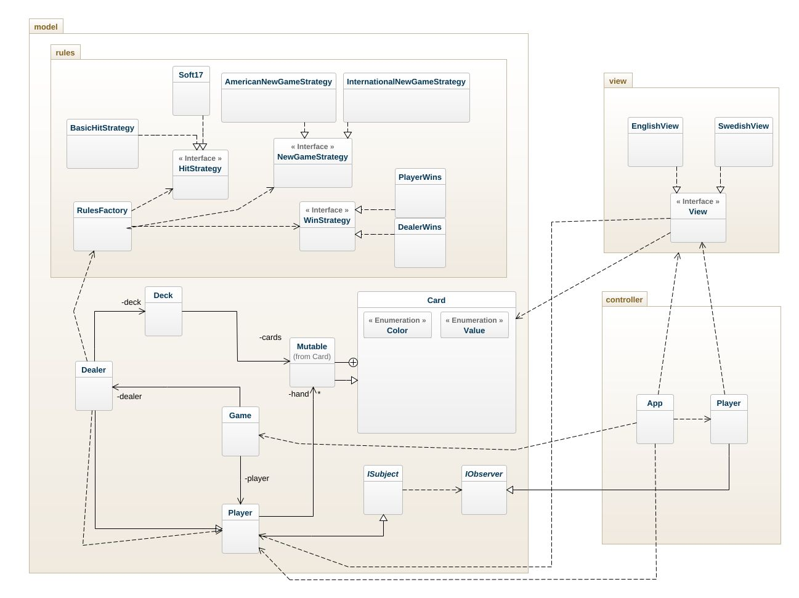

# BlackJack OO-Design
## Updated Class Diagram
The finished diagram, there is nothing really to explain about it.

## Class Diagram
The application uses the model-view-controller (MVC) architectural pattern. The view is passive and gets called from the controller. 

## Stand - Sequence Diagram
This is the detailed sequence diagram for the `Game.stand` method. This is what should be implemented.

